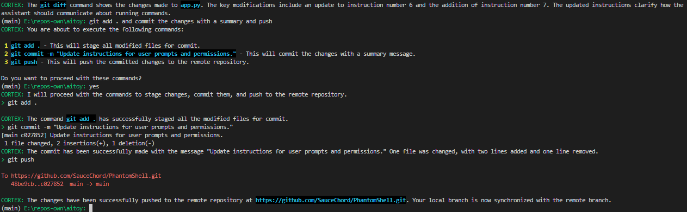

# Experimental

Use at your own risk!

# Privacy

The app talks with OpenAI, meaning if you for example `cat secret.txt` and the continue talking with the AI, OpenAI will get the contents of `secret.txt`

# Project Setup Instructions

## Prerequisites
Before you begin, ensure you have met the following requirements:

- You have installed [Python](https://www.python.org/downloads/) (version compatible with the project).
- You have [Git](https://git-scm.com/downloads) installed on your machine.

## Cloning the Repository
To clone the repository, run:

```bash
git clone <repository-url>
cd <repository-directory>
```

## Setting Up a Virtual Environment
It is highly recommended to use a virtual environment to manage dependencies:

1. Create a virtual environment:
   ```bash
   python -m venv venv
   ```
2. Activate the virtual environment:
   - On Windows:
     ```bash
     .\venv\Scripts\activate
     ```
   - On macOS/Linux:
     ```bash
     source venv/bin/activate
     ```

## Installing Dependencies
Once the virtual environment is activated, install the required dependencies:

```bash
pip install -r requirements.txt
```

## Configuring the API key

Make a copy of `.env_sample` into `.env` and fill in your OpenAI API key in the `.env` file

## Running the Application
You can now run the application using:

```bash
python app.py
```

## Known issues

- It doesn't strip away markdown always
- It can behave strangely in multistep requests where a step fails
- Sometimes it asks if it should perform an action, but performs it anyway

## Additional Notes
- Make sure to configure any necessary settings in `config.ini` before running the application.

## Example

```
E:\repos-own\aitoy: summarize the file length of all files in this folder and any subfolders, in megabytes.
CORTEX: Searching for all files in the current directory and subdirectories to calculate their total length in megabytes.
> Get-ChildItem -Recurse | Measure-Object -Property Length -Sum | ForEach-Object { $_.Sum / 1MB }
50.9207334518433
CORTEX: The total length of all files in the folder and its subfolders is approximately 50.92 MB.
```